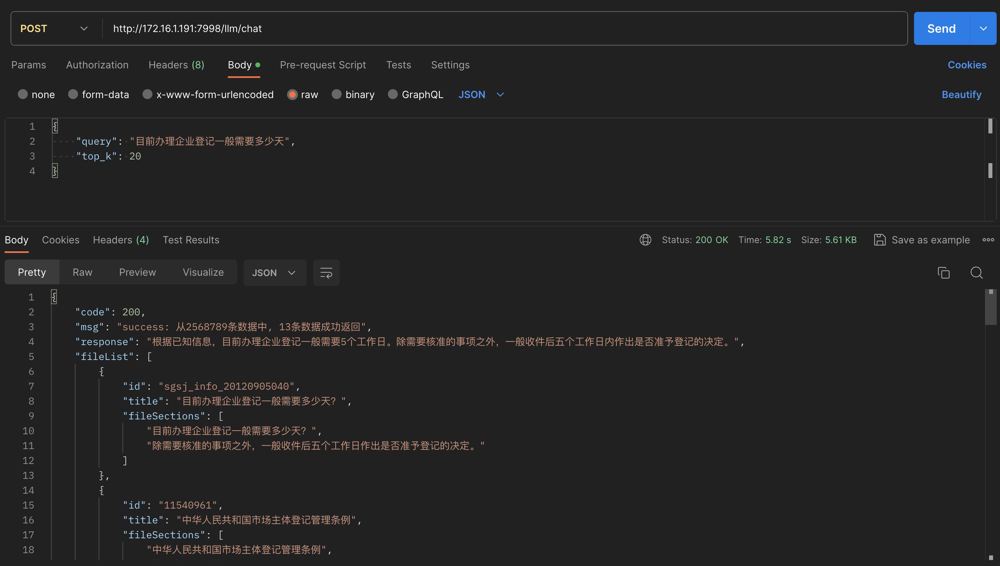
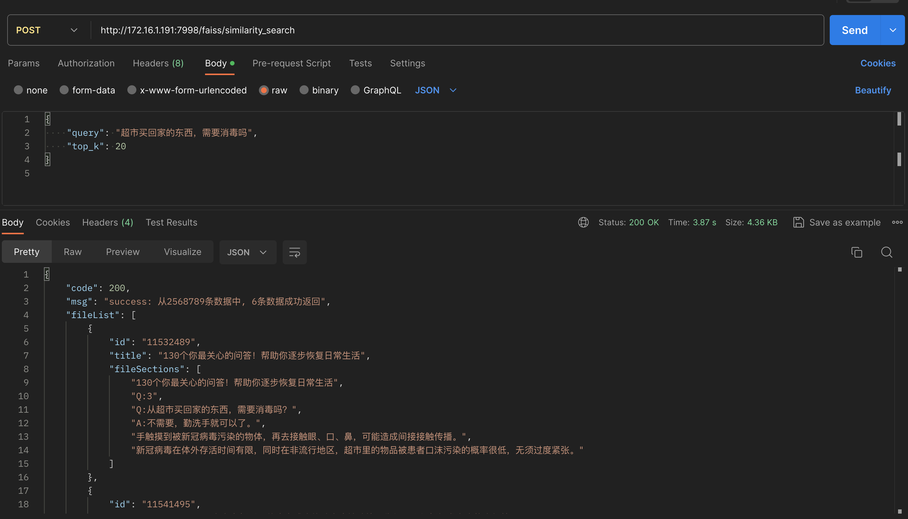

# 智能客服政策问答项目

## 1. 项目介绍

- 使用标准langchain流程：将数据通过bge向量模型导入faiss库中，使用服务时向量化query，然后在库中进行匹配，返回相似的文本片段，拼接到prompt中使用大模型chatglm3返回答案
- 原始数据为html格式，且为政策数据，最终选择使用树结构进行处理：将所有文本及表格提取出来，按照换行符及句号隔开。使用正则判断是否为标题，将每一句话/每一节点使用算法进行拼接，判断之间的关系。最终得到每一个节点的父节点和子节点。将父节点和当前节点进行拼接后再向量化导入库中，其他相关数据：content，parents，children作为每一条元数据。当在库中进行搜索时，返回所有信息，且对所有结果进行去重（如相同的父节点进行拼接），然后也将子节点进行适当拼接，最后使用大模型返回答案
- mix_search_wenda_dev.tar.gz 中还包含混合检索流程：对query提取关键词，对所有节点提取关键词，通过匹配的关键词数量决定相似度大小。实现方式是通过维护两个映射：kw_content_hash_map和content_hash_metadata_map。其中content_hash是将每个节点进行哈希过的唯一标识值，作为中间变量连接关键词和节点。最后将关键词相似度和向量相似度的范围缩到0-1区间，使用权重融合得到最终相似度。选择top_k个最高相似度的节点进行去重，拼接。
- 项目在XXX.XXX.XXX.XXX服务器上

## 2. 项目数据

- 数据库：XXX_INFO
- 使用字段：XXX_ID，XXX_CONTENT_TITLE，XXX_CONTENT

## 3. 项目架构

- 文件夹mix_search_qa：
    - 代码config.py：记录模型地址，数据库参数，FastAPI服务参数
    - 代码utils.py：处理html文本，正则切分，正则判断标题，使用树的方式合并，返回树节点列表
    - 代码db_to_faiss.py：读取数据库政策数据，批量处理，使用Faiss添加树节点，生成doc_tree.jsonl文件（用于debug）
    - 代码llm_chat.py：加载大模型，包装chat服务

    - 代码faiss_search.py：Faiss封装的类，包括对Faiss一系列操作

    - 代码api_faiss_wenda2.py：提供向量/混合搜索和大模型问答的服务

    - 代码api_faiss_wenda_lightllm.py：提供lightllm的推理服务

- 文件夹logs：保存日志文件：如api.log，db_to_faiss.log

- 文件夹vector_stores：保存使用Faiss构建的知识库

- 文件requirements.txt：项目使用的python包

- 文件doc_tree.jsonl：一个使用树结构的政策样例

## 4. 服务测试

- llm/chat：大模型问答接口。包含了大模型答案，及搜索到的片段，相同文件的片段进行了融合及去重。

- Faiss向量检索接口，包括混合检索

## 5. 注意事项

- 树结构中的id是文件名id，不能作为每个节点的唯一标识值。
- 由于大模型长度限制，对父/子节点进行拼接时最好设置最大长度，增加鲁棒性
- 目前baseline出现的问题：有一些特殊情况比如说答案包括几点，树这种结构可能不能全部命中。解决方法：增加top_k
- 在拼接prompt时，最好将相似度高的片段与问题相邻
- 大模型方向：将来可以尝试使用32k大模型，大一些的top_k提高模型表现
- 关键词匹配方向：调整融合权重，使用更有意义关键词。当前关键词是从政策名中人工提取。
